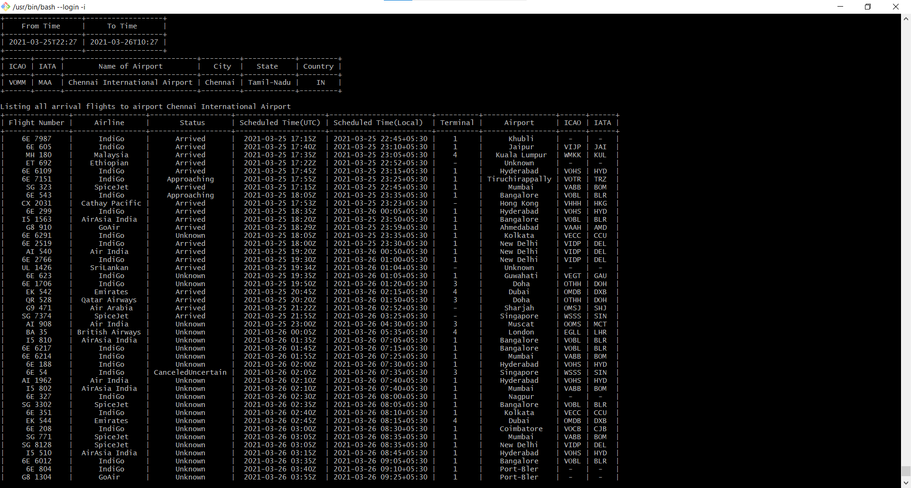
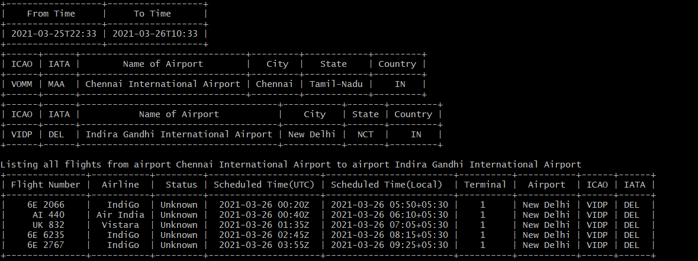
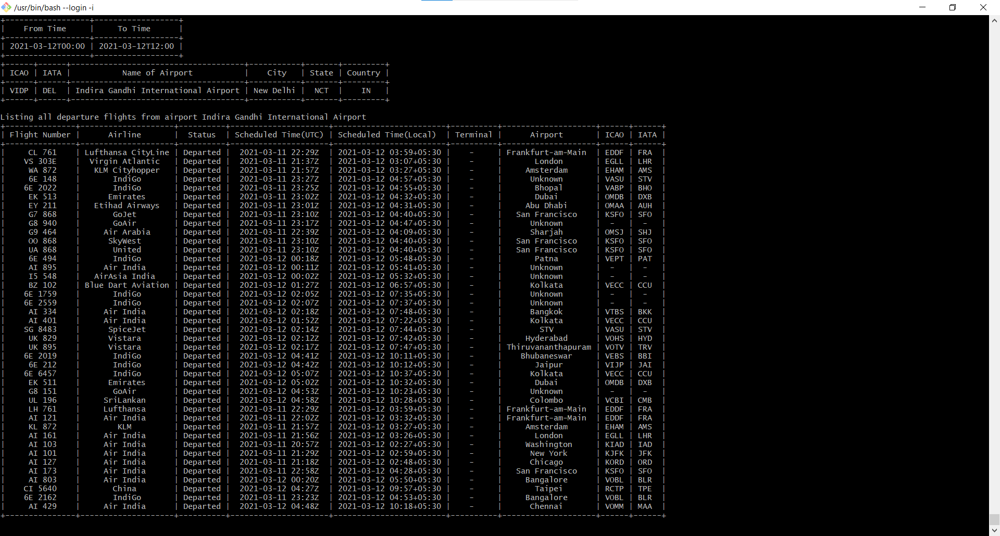
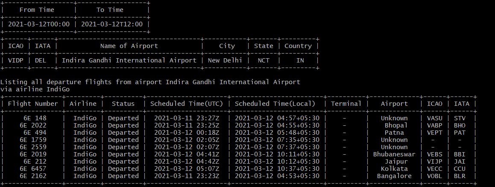
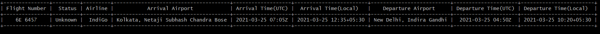
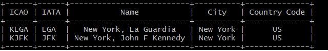
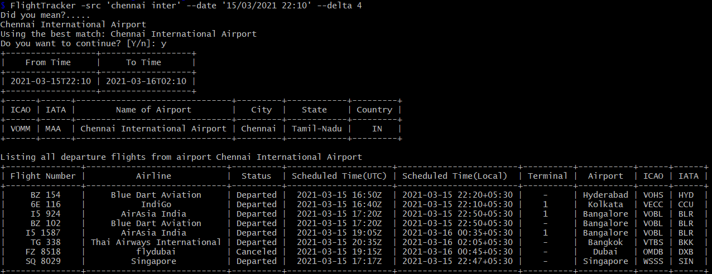

# Flight Tracker CLI
This is a command-line utility to list arrivals and departures information for any airport in the world using the airport's name or it's IATA or ICAO code. It can also be used to get flight's information using flight number.

## Dependencies
This package uses the API [AeroDataBox API](https://rapidapi.com/aerodatabox/api/aerodatabox/endpoints). I have used `Click` library for creating our command line interface. To do text correction I have used `difflib` library.  In addition to this, it also uses a json file to retrieve historical data on airports.

## Installation
To use this package we have to have an API key for the AeroDataBox API, you can get your free API key from [AeroDataBox API](https://rapidapi.com/aerodatabox/api/aerodatabox/endpoints). After getting the API key set your system's environment variable `AERO_KEY=<API-KEY>`.
* Clone the repo to your local directory `git clone https://github.com/asif-ali-244/FlightTracking.git`
* In your local directory create a virtual environment `python -m virtualenv venv`.
* Activate your virtual environment `source venv/Scripts/activate`.
* Install the package `pip install --editable .`
* Check using `FlightTracker --help`.

## Usage
```
$ FlightTracker --help
Usage: FlightTracker [OPTIONS] COMMAND [ARGS]...

  Retrieve flights for a certain airport or between two airports which
  arrived/departed on the mentioned date within a given time interval.

Options:
  -a, -dest, --arrivals TEXT   Destination Airport
  -d, -src, --departures TEXT  Source Airport
  -b, --date TEXT              Date
  -t, --delta INTEGER          Time Window in hours
  --airline TEXT               Airline Name
  --help                       Show this message and exit.

Commands:
  flight  Get Flight Status by using flight number and optional argument...
  search  Search airport information using name, ICAO, or IATA by string...

```

* The cli uses optional arguments `-src` as source airport and `-dest` as destination airport both of which can be an airport's name, it's IATA or ICAO code. **Spell Correction:** These two arguments also comes with an additional functionality of spell correction, if the user misspells the airport's name the cli will use the perfect match from airports data.
* At least one of the two `-src` and `-dest` need to be specified to retrieve the data. If only `-src` is given, then it will list all the flights departed from `-src`. If only `-dest` is given, then it will list all the flights arrived at `-dest`. In case if both are given, then it will list all flights from `-src` to `-dest`.
* `--date` or `-b` is the beginning time of our time interval. It accepts a string in the format `%d/%m/%Y` or `%d/%m/%Y %H:%M`. If this is not specified then it takes the current time as default value.
* `-t` or `--delta` is the time window in hours that will be added to our beginning time. It's default and maximum value is 12 hours.
* `--airline` tag will filter the result using airline name. 
* `flight` is a sub-command which is used to retrieve flight information using flight number.
* `search` is a sub-command which is used to search an airport's information by it's name, ICAO, IATA, or city. 

## Examples:

1. To list all the flights arrivals to Chennai International Airport. Note that airport names are case-insensitive.
```
    $ FlightTracker -dest 'MAA'
```

2. To list all the flights from Chennai International Airport(MAA) to Indira Gandhi International Airport(DEL)
```
    $ FlightTracker -src 'MAA' -dest 'DEL'
```

3. To list all depatures from Indira Gandhi International Airport(DEL) on 12/03/2021 
```
    $ FlightTracker -src 'DEL' --date 12/03/2021
```

4. To filter the above result by airline 'IndiGo'
```
    $ FlightTracker -src 'DEL' --date 12/03/2021 --airline 'IndiGo'
```

5. To get the recent status of flight number 6E6457
```
    $ FlightTracker flight 6E6457
```

6. To search for an airport in New York city.
```
    $ FlightTracker search 'New York'
```


7. The application can do text correction in case you have misspelled airport name or the name is not complete. For example, to list all the flights from `chennai inter` on date `15/03/2021 22:10` having a time window of `4` hours. Since there exist no airport named `chennai inter` it will search the database and list all the airport matches and will prompt the user to use the matches.
```
    $ FlightTracker -src 'chennai inter' --date '15/03/2021 22:10' --delta 4
```
